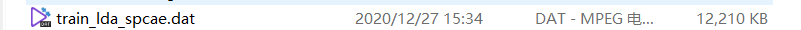
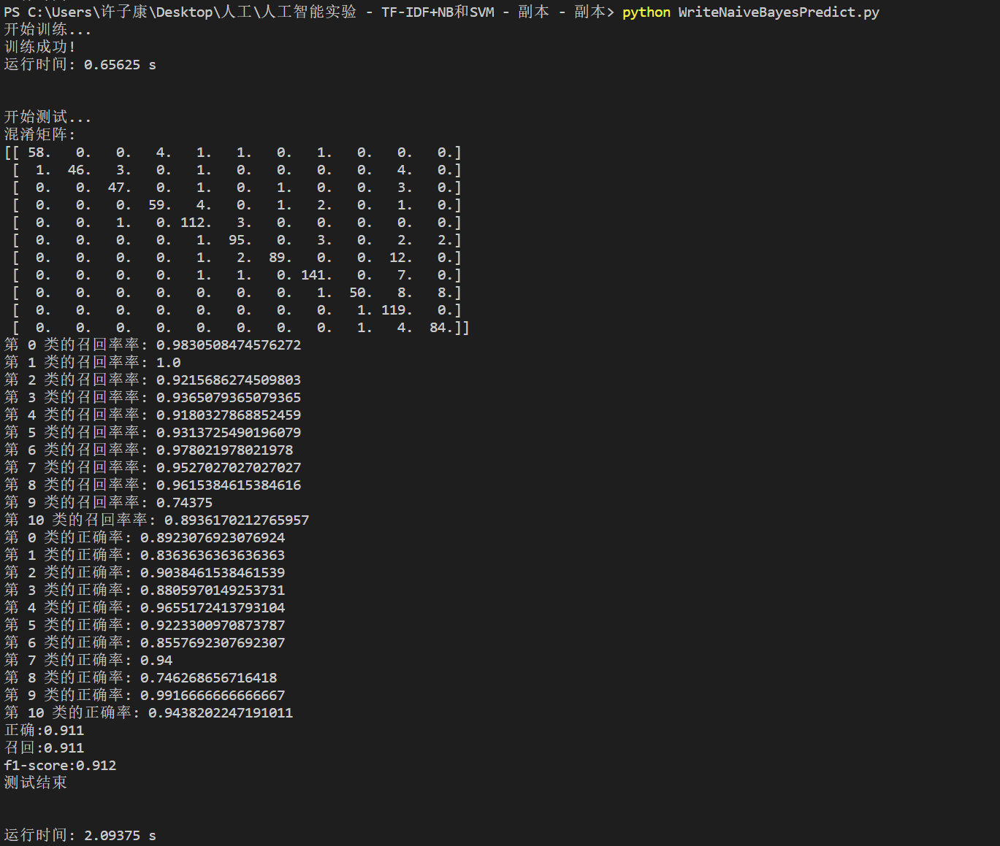
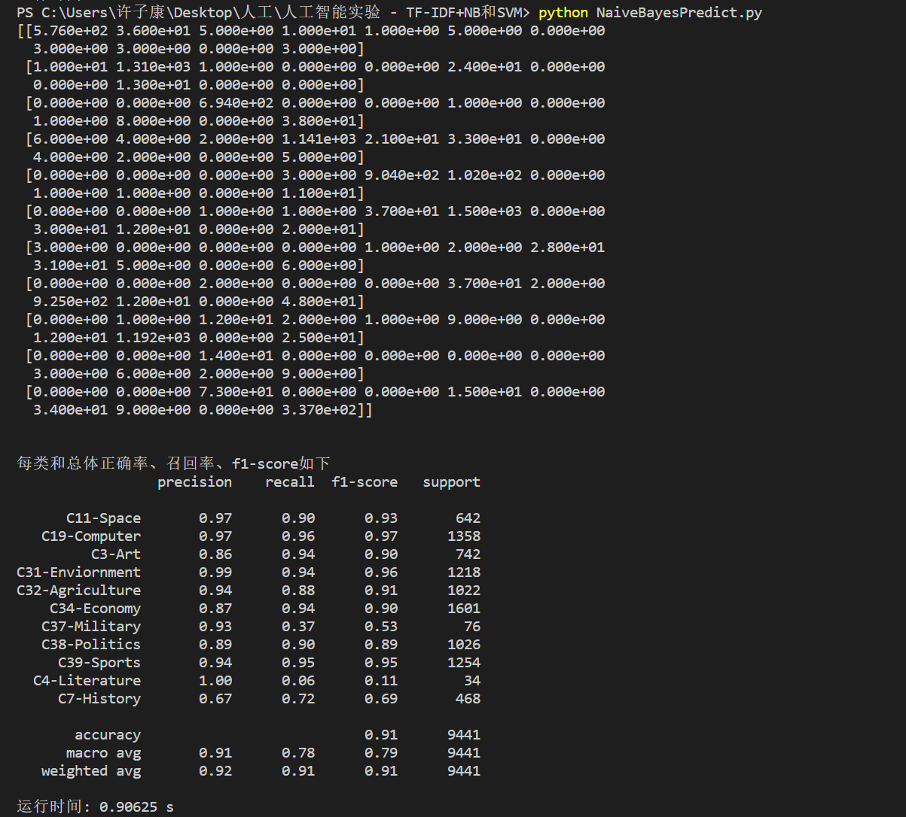
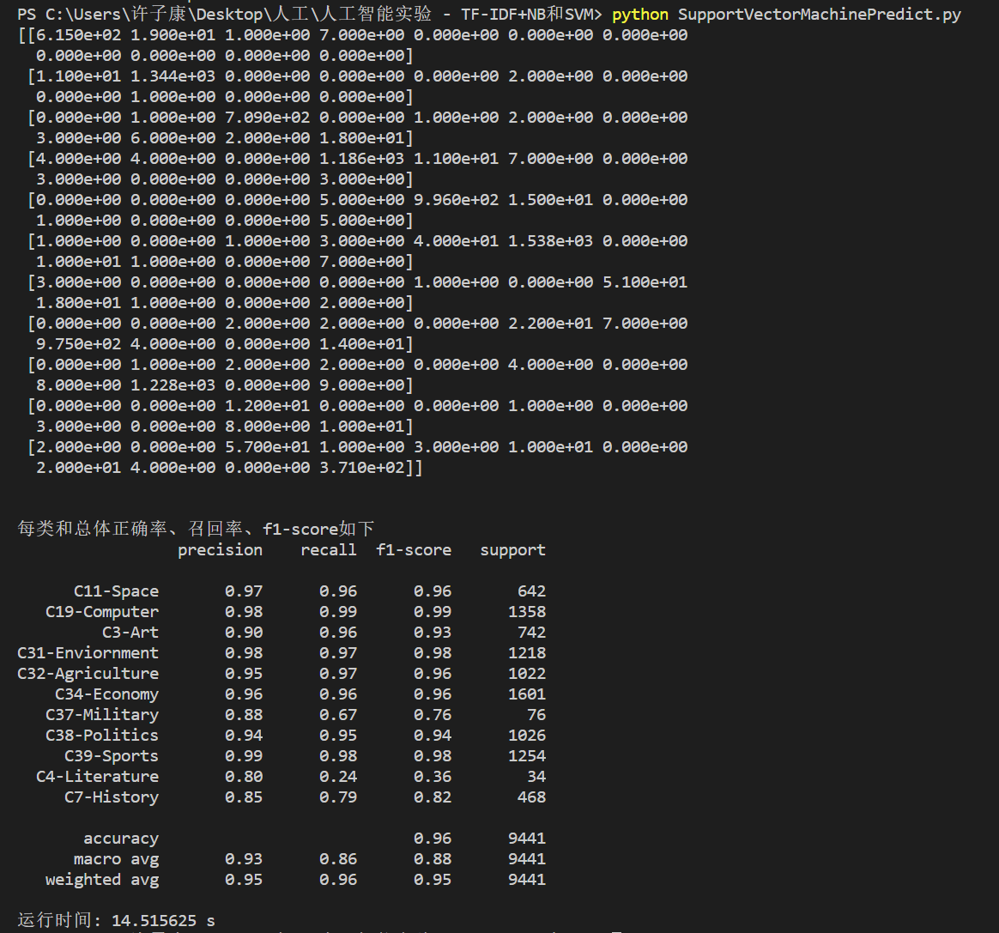

<h2 align = "center">文本数据的分类与分析</h2>

<h4 align = "center">班级：2018211310</h4>
<h4 align = "center">组号：68</h4>
<h4 align = "center">姓名：许子康</h4>
<h4 align = "center">学号：2018211514</h4>
<h4 align = "center">实验日期：2021.01.01</h4>

## 一、实验目的

1. 掌握数据预处理的方法，对训练集数据进行预处理；
2. 掌握文本建模的方法，对语料库的文档进行建模；
3. 掌握分类算法的原理，基于有监督的机器学习方法，训练文本分类器；
4. 利用学习的文本分类器，对未知文本进行分类判别；
5. 掌握评价分类器性能的评估方法。

## 二、实验类型

&emsp;&emsp;人工智能认知验证实验。

## 三、实验要求
1. 个人独立实现实验；
2. 文本类别数：$\ge10$类；
3. 训练集文档数：$\ge 50000$篇；每类平均$5000$篇；
4. 测试集文档数：$\ge 50000$篇；每类平均$5000$篇；
5. 使用合适的降维方法；
6. 判断停用词表是否合理并作出适当调整；
7. 改进加权方法和其他改进方法；
8. 朴素贝叶斯分类器要手动编写完成。

## 四、实验内容
利用分类算法实现对文本的数据挖掘，主要包括：
1. 语料库的构建，主要从搜狗语料库、复旦大学中文语料库等搜集文章作为训练集和测试集；
2. 语料库的数据预处理，包括文档建模，如去噪，分词，建立数据字典，使用词袋模型$(TF-IDF)$或主题模型$(LDA)$表达文档等；
3. 选择分类算法(朴素贝叶斯$NaiveBayes$、支持向量机$SVM$)，训练文本分类器，理解所选的分类算法的建模原理、实现过程和相关参数的含义；
4. 对测试集的文本进行分类；
5. 对测试集的分类结果利用正确率和召回率进行分析评价：计算每类正确率、召回率，计算总体正确率和召回率。

## 五、实验步骤

#### 1、语料库的构建
&emsp;&emsp;①选择复旦大学中文语料库，下载Art、Literature、Education、Philosophy、History、Space、Energy、Electronics、Communication、Computer、Mine、Transport、Environment、Agriculture、Economy、Law、Medical、Military、Politics、Sports共$20$类文章。
&emsp;&emsp;②选择其中文章数量最多的$10$类作为总语料库，将每类文章平均分为两部分，一部分作为训练集，另一部分作为测试集，平均每类文章测试集和训练集均为$1000$篇，比例$1:1$。
&emsp;&emsp;③平时测试使用$20$类中文章数量较少的$10$类进行测试，避免过长的分词、建模、训练和测试时间，提高实验效率。
&emsp;&emsp;④复旦大学语料库下载网址：https://download.csdn.net/download/weixin_44210339/10902090?utm_source=bbsseo
#### 2、语料库的分词处理
&emsp;&emsp;分词采用结巴分词系统，首先对原始的文本进行分词处理，保留词语和词性，然后根据词性筛选出名词相关词，然后根据停等词表进行去停等词操作。
&emsp;&emsp;根据实际应用发现，给定的停等词表不全，故后续添加〔、〕、（、）、【、】、-等符号，进一步完善停等词表。
```python
content = readFile(fullname)
# 删除换行、空行和多余空格
content = content.replace('\r\n'.encode('utf-8'), ''.encode('utf-8')).strip()
content = content.replace(' '.encode('utf-8'), ''.encode('utf-8')).strip()

# 调用jieba，进行分词
content_fenci = jieba.posseg.cut(content)
fenci_list = []
for x in content_fenci:
    if 'n' in x.flag:
        fenci_list.append(x.word)
newContent = []
for myword in fenci_list:
    if (myword not in stop_words_dict):
        newContent.append(myword)
```
#### 3、语料库的类型转换存储
&emsp;&emsp;①分词后的文本格式不方便直接使用，而且读文件写文件花费时间极高，因此需要先将文本内容转为易存取易操作的格式，方便进行后续模式表达和文本分类操作。
&emsp;&emsp;②选择$sklearn.utils$中的$Bunch$类，$Bunch$本质上的数据类型是$dict$,方便存取和其他操作。
&emsp;&emsp;③定义三个属性，分别表示分类（子目录），文件全路径，文件内容，把训练集和测试集的文本文件分别存储到一个$bunch$中，然后将$bunch$存储到$.dat$文件中。
```python
bunch = Bunch(label = [], filenames = [], contents = [])
```


```python
import os
import time
import pickle

from sklearn.utils import Bunch
from Tools import readFile, writeBunchObj

def SetsToBunchProcess(initial_path, target_path):
    print("开始构建文本对象...")
    # 获取分词处理后的集合的所有子目录
    dir_list = os.listdir(initial_path)

    # 创建一个存储信息的Bunch类
    # 分类（子目录），文件全路径，文件内容
    bunch = Bunch(label = [], filenames = [], contents = [])

    for mydir in dir_list:
        ini_path = initial_path + mydir + "/" #子目录的子目录
        file_list = os.listdir(ini_path) # ini_path下所有文件，也就是训练集和测试集
        
        for myfile in file_list:
            fullname = ini_path + myfile
            bunch.label.append(mydir) # 类别
            bunch.filenames.append(fullname) # 全路径
            bunch.contents.append(readFile(fullname)) # 文件内容
    
    writeBunchObj(target_path, bunch)
    print("构建文本对象结束！")


if __name__ == "__main__":
    time1 = time.process_time()

    # 对训练集进行Bunch化操作，生成.dat数据文件
    print("对训练集Bunch化，构造文本对象...")
    training_sets_path = "./ProcessedTrainingSets/"
    target_bunch_path = "./BunchOfTrainingSets/BunchOfTrainingSets.dat"
    SetsToBunchProcess(training_sets_path, target_bunch_path)

    time2 = time.process_time()
    print('运行时间: %s s\n\n' % (time2 - time1))

    # 对测试集进行Bunch化操作，生成.dat数据文件
    print("对测试集Bunch化，构造文本对象...")
    training_sets_path = "./ProcessedTestSets/"
    target_bunch_path = "./BunchOfTestSets/BunchOfTestSets.dat"
    SetsToBunchProcess(training_sets_path, target_bunch_path)

    time3 = time.process_time()
    print('运行时间: %s s' % (time3 - time2))
```
#### 4、语料库的模型表达
##### 1)、词袋模型$(TF-IDF)$
&emsp;&emsp;$TF-IDF$($term$ $frequency–inverse$ $document$ $frequency$，词频-逆向文件频率)是一种用于信息检索($information$ $retrieval$)与文本挖掘($text$ $mining$)的常用加权技术。
&emsp;&emsp;$TF-IDF$是一种统计方法，用以评估一字词对于一个文件集或一个语料库中的其中一份文件的重要程度。字词的重要性随着它在文件中出现的次数成正比增加，但同时会随着它在语料库中出现的频率成反比下降。
&emsp;&emsp;$TF-IDF$的主要思想是：如果某个单词在一篇文章中出现的频率TF高，并且在其他文章中很少出现，则认为此词或者短语具有很好的类别区分能力，适合用来分类。
&emsp;&emsp;① $TF$是词频($Term$ $Frequency$), 词频($TF$)表示词条(关键字)在文本中出现的频率。 这个数字通常会被归一化(一般是词频除以文章总词数), 以防止它偏向长的文件。
$$
tf_{i,j}=\frac{n_{i,j}}{\sum_{k}{n_{k,j}}}
$$
&emsp;&emsp;即
$$
TF_{w} = \frac{在某一类中词条w出现的次数}{该类中所有词条的数目}
$$
&emsp;&emsp;② $IDF$是逆向文件频率($Inverse$ $Document$ $Frequency$)，逆向文件频率 ($IDF$) ：某一特定词语的$IDF$，可以由总文件数目除以包含该词语的文件的数目，再将得到的商取对数得到。如果包含词条t的文档越少, IDF越大，则说明词条具有很好的类别区分能力。
$$
idf_i=\log\frac{|D|}{|\{j:t_i\in d_j\}|}
$$
&emsp;&emsp;其中，$|D|$ 是语料库中的文件总数。 $|\{j:t_i\in d_j\}|$表示包含词语 $t_i$ 的文件数目（即 $n_i,j≠0$ 的文件数目）。如果该词语不在语料库中，就会导致分母为零，因此一般情况下使用$1+|\{j:t_i\in d_j\}|$
&emsp;&emsp;即
$$
IDF=\log(\frac{语料库的文档总数}{包含词条w的文档数+1})
$$
&emsp;&emsp;③TF-IDF实际上是：$TF * IDF$。某一特定文件内的高词语频率，以及该词语在整个文件集合中的低文件频率，可以产生出高权重的$TF-IDF$。因此，$TF-IDF$倾向于过滤掉常见的词语，保留重要的词语。
$$
TF-IDF = TF*IDF
$$
&emsp;&emsp;使用$TF-IDF$的词袋模型，同样选择$sklearn.utils$中的$Bunch$类,在第二步的基础上增加两个属性$tdm$和$vocabulary$，其中$tdm$存储的是计算出的$TF-IDF$的值，$vocabulary$存储的是词汇表，其中测试集的$Bunch$的$vocabulary$要设定为训练集的$vocabulary$，由此保证测试集和训练集的环境一致。测试集和训练集的$tdm$可以直接调用$python$内置的库函数直接进行计算。最后将新的信息的$Bunch$类储存到新的$.dat$文件中。


```python
import os
import time
import pickle

from sklearn.utils import Bunch
from sklearn.feature_extraction.text import TfidfVectorizer
from Tools import readFile, readBunchObj, writeBunchObj

def vector_space(bunch_path, space_path, train_tfidf_path = None):
    print("开始生成TF-IDF词向量空间...")
    bunch = readBunchObj(bunch_path)
    tfidfSpace = Bunch(label = bunch.label, filenames = bunch.filenames, tdm = [], vocabulary = {})

    if train_tfidf_path is None:
        # 对训练集进行处理，生成训练集的tf-idf词向量空间
        vectorizer = TfidfVectorizer(sublinear_tf = True, max_df = 0.5)
        tfidfSpace.tdm = vectorizer.fit_transform(bunch.contents)
        tfidfSpace.vocabulary = vectorizer.vocabulary_
    else:
        # 对测试集进行处理，生成测试集的tf-idf词向量空间，利用训练集的信息
        trainBunch = readBunchObj(train_tfidf_path)
        tfidfSpace.vocabulary = trainBunch.vocabulary
        vectorizer = TfidfVectorizer(sublinear_tf = True, max_df = 0.5, vocabulary = trainBunch.vocabulary)
        tfidfSpace.tdm = vectorizer.fit_transform(bunch.contents)
        
    writeBunchObj(space_path, tfidfSpace)
    print("TF-IDF词向量空间生成完毕!")

if __name__ == '__main__':
    time1 = time.process_time()
    # 对训练集进行处理，生成训练集的tf-idf词向量空间
    bunch_path = "./BunchOfTrainingSets/BunchOfTrainingSets.dat"
    space_path = "./BunchOfTrainingSets/train_tfidf_spcae.dat"
    vector_space(bunch_path, space_path)

    time2 = time.process_time()
    print('运行时间: %s s\n\n' % (time2 - time1))

    # 对测试集进行处理，生成测试集的tf-idf词向量空间，利用训练集的信息
    bunch_path = "./BunchOfTestSets/BunchOfTestSets.dat"
    space_path = "./BunchOfTestSets/test_tfidf_space.dat"
    train_tfidf_path = "./BunchOfTrainingSets/train_tfidf_spcae.dat"
    vector_space(bunch_path, space_path, train_tfidf_path)
    
    time3 = time.process_time()
    print('运行时间: %s s' % (time3 - time2))
```
##### 2)、主题模型$(LDA)$
&emsp;&emsp;主题模型选择隐含狄利克雷分布$LDA$($Latent$ $Dirichlet$ $Allocation$)。$LDA$是基于贝叶斯模型的，涉及到贝叶斯模型离不开“先验分布”，“数据（似然）”和"后验分布"三块。在贝叶斯学派这里：先验分布 + 数据（似然）= 后验分布
&emsp;&emsp;在$LDA$模型中，我们需要先假定一个主题数目$K$，这样所有的分布就都基于$K$个主题展开。
&emsp;&emsp;$LDA$假设文档主题的先验分布是$Dirichlet$分布，即对于任一文档$d$, 其主题分布$θ_d$为：
$$
θ_d=Dirichlet(\vecα)
$$
&emsp;&emsp;其中，$α$为分布的超参数，是一个$K$维向量。
&emsp;&emsp;$LDA$假设主题中词的先验分布是$Dirichlet$分布，即对于任一主题$k$, 其词分布$β_k$为：
$$
β_k=Dirichlet(\vecη)
$$
&emsp;&emsp;其中，$η$为分布的超参数，是一个$V$维向量。V代表词汇表里所有词的个数。
&emsp;&emsp;对于数据中任一一篇文档$d$中的第$n$个词，我们可以从主题分布$θ_d$中得到它的主题编号$z_{dn}$的分布为：
$$
z_{dn}=multi(θ_d)
$$
&emsp;&emsp;而对于该主题编号，得到我们看到的词$w_{dn}$的概率分布为： 
$$
w_{dn}=multi(β_{z_{dn}})
$$
&emsp;&emsp;这个模型里，有$M$个文档主题的$Dirichlet$分布，而对应的数据有$M$个主题编号的多项分布，这样$(α\rightarrow θ_d \rightarrow \vec{z_d})$就组成了$Dirichlet-multi$共轭，可以使用前面提到的贝叶斯推断的方法得到基于$Dirichlet$分布的文档主题后验分布。
&emsp;&emsp;如果在第$d$个文档中，第$k$个主题的词的个数为：$n^{(k)}_{d}$, 则对应的多项分布的计数可以表示为
$$
\vec{n_d}=(n^{(1)}_d,n^{(2)}_d,...,n^{(K)}_d)
$$
&emsp;&emsp;利用$Dirichlet-multi$共轭，得到$θ_d$的后验分布为：
$$
Dirichlet(θ_d|\vec α + \vec{n_d})
$$
&emsp;&emsp;同样的道理，对于主题与词的分布，我们有$K$个主题与词的$Dirichlet$分布，而对应的数据有$K$个主题编号的多项分布，这样$(η \rightarrow β_k \rightarrow \vec{w_{(k)}})$就组成了$Dirichlet-multi$共轭，可以使用前面提到的贝叶斯推断的方法得到基于$Dirichlet$分布的主题词的后验分布。
&emsp;&emsp;如果在第$k$个主题中，第$v$个词的个数为：$n^{(v)}_k$, 则对应的多项分布的计数可以表示为
$$
\vec{n_k}=(n^{(1)}_k,n^{(2)}_k,...,n^{(V)}_k)
$$
&emsp;&emsp;利用$Dirichlet-multi$共轭，得到$β_k$的后验分布为：
$$
Dirichlet(β_k|\vec η+ \vec{n_k})
$$
&emsp;&emsp;由于主题产生词不依赖具体某一个文档，因此文档主题分布和主题词分布是独立的。通过上面这$M+K$组$Dirichlet-multi$共轭，就能理解了$LDA$的基本原理。
&emsp;&emsp;使用$LDA$的主题模型，同样选择$sklearn.utils$中的$Bunch$类,在第二步的基础上增加两个属性$tdm$和$vocabulary$，其中$tdm$存储的是计算出的特征值，$vocabulary$存储的是词汇表。与词袋模型一致，测试集的$Bunch$的$vocabulary$要设定为训练集的$vocabulary$，由此保证测试集和训练集的环境一致。测试集和训练集的$tdm$可以直接调用$python$内置的库函数直接进行计算。最后将新的信息的$Bunch$类储存到新的$.dat$文件中。


```python
import os
import time
import pickle

from sklearn.utils import Bunch
from sklearn.feature_extraction.text import CountVectorizer
from sklearn.feature_extraction.text import TfidfVectorizer
from Tools import readFile, readBunchObj, writeBunchObj
from sklearn.decomposition import LatentDirichletAllocation


def vector_space(bunch_path, space_path, train_lda_path = None):
    print("开始LDA构建词模型...")
    bunch = readBunchObj(bunch_path)
    ldaSpace = Bunch(label = bunch.label, filenames = bunch.filenames, tdm = [], vocabulary = {})

    if train_lda_path is None:
        # 对训练集进行处理
        vectorizer = CountVectorizer()
        counts_train = vectorizer.fit_transform(bunch.contents)
        ldaSpace.vocabulary = vectorizer.vocabulary_
        lda = LatentDirichletAllocation(n_components = 10, max_iter = 50, learning_method = 'batch')
        ldaSpace.tdm = lda.fit(counts_train).transform(counts_train)
    else:
        # 对测试集进行处理，利用训练集的信息
        trainBunch = readBunchObj(train_lda_path)
        ldaSpace.vocabulary = trainBunch.vocabulary
        vectorizer = CountVectorizer(vocabulary = trainBunch.vocabulary)
        counts_test = vectorizer.fit_transform(bunch.contents)
        lda = LatentDirichletAllocation(n_components = 10, max_iter = 50, learning_method = 'batch')
        ldaSpace.tdm = lda.fit(counts_test).transform(counts_test)

    writeBunchObj(space_path, ldaSpace)
    print("LDA构建词模型结束!")

if __name__ == '__main__':
    time1 = time.process_time()
    # 对训练集进行处理,LDA构建词模型
    bunch_path = "./BunchOfTrainingSets/BunchOfTrainingSets.dat"
    space_path = "./BunchOfTrainingSets/train_lda_spcae2.dat"
    vector_space(bunch_path, space_path)

    time2 = time.process_time()
    print('运行时间: %s s\n\n' % (time2 - time1))

    # 对测试集进行处理，LDA构建词模型，利用训练集的信息
    bunch_path = "./BunchOfTestSets/BunchOfTestSets.dat"
    space_path = "./BunchOfTestSets/test_lda_space2.dat"
    train_lda_path = "./BunchOfTrainingSets/train_lda_spcae2.dat"
    vector_space(bunch_path, space_path, train_lda_path)
    
    time3 = time.process_time()
    print('运行时间: %s s' % (time3 - time2))
```

#### 5、使用分类算法，训练文本分类器并进行文本分类
##### 1)、朴素贝叶斯$(NaiveBayes)$
&emsp;&emsp;贝叶斯算法关注的是文档属于某类别概率。
&emsp;&emsp;文档属于某个类别的概率等于文档中每个词属于该类别的概率的综合表达式。
&emsp;&emsp;而每个词属于该类别的概率又在一定程度上可以用这个词在该类别训练文档中出现的次数（词频信息）来粗略估计，因而使得整个计算过程成为可行的。
&emsp;&emsp;使用朴素贝叶斯算法时，在训练阶段的主要任务就是估计这些值。
&emsp;&emsp;①先验概率$P(B)$:根据以往经验和分析得到的概率。先验概率是一种常识性、经验性认知，比如抛硬币正反面的概率是$1/2$。
&emsp;&emsp;②后验概率$P(A|B)$:某个因素的到来影响了对某个结果发生可能性的判断。后验概率是基于已知，对结果发生的可能性一种推测。
&emsp;&emsp;③贝叶斯公式
$$
P(C|X)=\frac{P(X|C)P(C)}{P(X)}
$$
&emsp;&emsp;其中，$P(C|X)$是根据样本$X$对类别$C$的预测值。$P(C)$是类先验概率，它表示为某类样本在总样本中出现的可能性，对于某个样本，$P(X)$与样本分类无关。因此，求贝叶斯公式的关键在于求类条件概率$P(X|C)$。
&emsp;&emsp;④对数极大似然估计
&emsp;&emsp;似然即类条件概率$P(X|C)$，假设$P(X|C)$被参数向量$θ_c$唯一确定，则参数$θ_c$对数据样本某类类别为$C$的训练样本$D_c$的似然可以表示为：
$$
P(D_c|θ_c) = \prod_{x \in D_c}P(x|θ_c)
$$
&emsp;&emsp;对$θ_c$进行极大似然估计，就是去寻找最大化似然$P(D_c|θ_c)$的参数。在文本分类的实际问题中，表现为寻找一个最可能使数据$D_c$出现的类别，即：为数据$D_c$找到最可能的分类。
&emsp;&emsp;在上面公式中，因为每个文本类别的属性值往往有多个，这种连乘操作容易造成下溢，因此需要估计对数似然：
$$
LL(θ_c)=\log P(D_c|θ_c)=\sum_{x \in D_c}\log P(x|θ_c)
$$
&emsp;&emsp;此时，多个属性的连乘就通过对数函数表现为相加,对参数$θ_c$的极大似然估计表现为
$$
\hat{θ_c}=arg max LL(θ)
$$
&emsp;&emsp;⑤在实际分类问题中，样本的属性有可能是互相关联的，比如：$x_1$的出现有可能会影响到$x_2$的出现。对于类条件概率$P(X|C)$,它涉及$X$中所有属性的联合概率，直接根据样本频率去估计，假设有$d$个属性，假设每个属性有$n$种可能取值，样本空间则有$n^d$种排列，远远大于训练样本数。难以从有限样中估计得到。
&emsp;&emsp;朴素贝叶斯分类器的“朴素”之处在于：假设这些属性都是独立的。即每个属性都独立的对结果造成影响。基于这种思想，贝叶斯公式可以改写为：
$$
P(c|x)=\frac{P(c)P(x|c)}{P(x)}=\frac{P(c)}{P(x)}\prod^{d}_{i=1}P(x_i|c)
$$
&emsp;&emsp;对于所有类别来说，P(x)相同，不起作用。所以，朴素贝叶斯公式的准则可以进一步表达为：
$$
h_{nb}(x)=arg max_{c \in y} P(c)\prod^{d}_{i=1}P(x_i|c)
$$
其中$h_{nb}(x)$为错误率，就等于最大化似然，也就是朴素贝叶斯分类器输出的目标值。
&emsp;&emsp;⑥需要注意的是，在文本分类中，各成员的实际意义表示为：
$$
P(c)=\frac{第c类样本数}{全部样本数}
$$
$$
P(x_i|c)=\frac{某个词语出现的次数}{某类样本中全部的词语总数}
$$
&emsp;&emsp;此时有一个问题：假设测试样本中某个单词在训练样本中没有出现过，那么似然估计结果为$0$，会导致估计错误。因此需要对数据做拉普拉斯平滑处理。处理过程如下：
$$
\hat{P(c)}=\frac{第c类样本数+1}{全部样本数+样本类别数}
$$
$$
\hat{P(x_i|c)}=\frac{当前词语出现的次数+1}{某类样本中全部的词语总数+样本类别数}
$$
&emsp;&emsp;这样就有效解决了某个出现新词语导致的连乘结果为$0$的问题。
&emsp;&emsp;朴素贝叶斯($Naive Bayes$)分类器的训练和测试过程可以手写，也可以直接调用$python$的内置函数。手写时对拉普拉斯平滑的参数进行了不同的尝试，发现取$0.025$时，正确率达到较高值。手写贝叶斯分类器和调用函数代码如下：
* 手写贝叶斯分类器
```python
import os
import time
import pickle
import numpy as np


from sklearn.utils import Bunch
from sklearn import metrics
from Tools import readBunchObj
from sklearn.feature_extraction.text import TfidfVectorizer, CountVectorizer

from sklearn.feature_extraction.text import TfidfTransformer
from sklearn.naive_bayes import MultinomialNB # 导入多项式贝叶斯算法
from sklearn import svm
from sklearn.metrics import classification_report, confusion_matrix


def metrics_result(actual, predict):
    print('正确:{0:.3f}'.format(metrics.accuracy_score(actual, predict)))
    print('召回:{0:0.3f}'.format(metrics.recall_score(actual, predict, average='weighted')))
    print('f1-score:{0:.3f}'.format(metrics.f1_score(actual, predict, average='weighted')))

if __name__ == "__main__":
    time1 = time.process_time()
    print("开始训练...")
    # 导入训练集
    bunch = readBunchObj("./BunchOfTrainingSets/BunchOfTrainingSets.dat")
    tfidfSpace = Bunch(label = bunch.label, filenames = bunch.filenames, tdm = [], vocabulary = {})
    
    trainSpace = Bunch(label = bunch.label, filenames = bunch.filenames, tdm = [], vocabulary = {})

    vector = CountVectorizer()
    transformer = TfidfTransformer()
    train_tfidf = transformer.fit_transform(vector.fit_transform(bunch.contents))
    trainSpace.vocabulary = vector.vocabulary_
    word = vector.get_feature_names()
    weight = train_tfidf.toarray()
    
    # print(train_tfidf.nonzero())
    Index = train_tfidf.nonzero()
    tmpx = Index[0]
    tmpy = Index[1]

    # print(len(tmpx))

    n = len(weight)
    m = len(word)

    labels = dict()
    relabels = []
    Belong = np.zeros(len(weight))
    cnt = 0
    i = 0
    preCount = []
    for mylabel in tfidfSpace.label:
        if (mylabel not in labels):
            labels[mylabel] = cnt
            relabels.append(mylabel)
            preCount.append(0)
            cnt = cnt + 1
        Belong[i] = labels[mylabel]
        preCount[int(Belong[i])] = preCount[int(Belong[i])] + 1
        i = i + 1
    # print(cnt)
    # print(m)
    mat = np.zeros((cnt, m))
    sumval = np.zeros(cnt)

    for i in range(cnt):
        preCount[i] = preCount[i] / n
        # print(preCount[i])

    for id in range(len(tmpx)):
        i = tmpx[id]
        j = tmpy[id]
        mat[int(Belong[i])][j] = mat[int(Belong[i])][j] + weight[i][j]
        sumval[int(Belong[i])] = sumval[int(Belong[i])] + weight[i][j]

    absSum = 0
    for i in range(cnt):
        absSum = absSum + sumval[i]

    for i in range(cnt):
        for j in range(m):
            mat[i][j] = (mat[i][j] + 0.025)/ (sumval[i] + absSum)
            # print(mat[i][j], end= " ")
        # print("")
    # print(mat)
    
    reword = dict()
    for i in range(m):
        reword[word[i]] = i
    
    

    mat = np.log(mat)
    preCount = np.log(preCount)

    # for i in range(cnt):
    #         for j in range(m):
    #             print(mat[i][j])
    
    print("训练成功!")
    time2 = time.process_time()    
    print('运行时间: %s s\n\n' % (time2 - time1))
    
    # 导入测试集
    print("开始测试...")
    bunch = readBunchObj("./BunchOfTestSets/BunchOfTestSets.dat")
    tfidfSpace = Bunch(label = bunch.label, filenames = bunch.filenames, tdm = [], vocabulary = {})
    
    vector = CountVectorizer(vocabulary = trainSpace.vocabulary)
    transformer = TfidfTransformer()
    test_tfidf = transformer.fit_transform(vector.fit_transform(bunch.contents))
    word = vector.get_feature_names()
    weight = test_tfidf.toarray()
    
    Index = test_tfidf.nonzero()
    tmpx = Index[0]
    tmpy = Index[1]

    ActBelong = np.zeros(len(tfidfSpace.label))
    cnt1 = 0
    i1 = 0
    labels1 = dict()
    preCount1 = np.zeros(cnt)
    for mylabel in tfidfSpace.label:
        if (mylabel not in labels1):
            labels1[mylabel] = cnt1
            cnt1 = cnt1 + 1
        ActBelong[i1] = labels[mylabel]
        preCount1[int(ActBelong[i1])] += 1
        i1 = i1 + 1

    ntest = len(weight)
    n = len(weight)
    m = len(word)

    errNum = 0
    errNumList = np.zeros(cnt)
    
    corWords = []
    for i in range(ntest):
        corWords.append([])

    # for i in range(ntest):
    for j in range(len(tmpx)):    
        corWords[tmpx[j]].append(tmpy[j])

    
    confusion_matrix = np.zeros((cnt, cnt))

    actual = []
    predict = []
    for i in range(ntest): # 文章
        Max = -1000000000000
        Type = -1
        for k in range(cnt): # 所有类
            now = preCount[k]
            for j in corWords[i]:
                now = now + mat[k][j] * weight[i][j]
            if Max < now:
                Max = now
                Type = k
            # print(Max, Type)

        if Type != int(ActBelong[i]):
            errNumList[int(ActBelong[i])] += 1
            errNum += 1
            confusion_matrix[int(ActBelong[i])][Type] += 1
        else:
            confusion_matrix[int(ActBelong[i])][int(ActBelong[i])] += 1
        actual.append(ActBelong[i])
        predict.append(Type)

    print("混淆矩阵:")
    print(confusion_matrix)

    for j in range(cnt):
        tot = 0
        for i in range(cnt):
            tot += confusion_matrix[i][j]
        
        print("第", j, end = " ")
        print("类的召回率率:", (confusion_matrix[j][j])/tot)

    for i in range(cnt):
        print("第", i, end = " ")
        print("类的正确率:", (preCount1[i] - errNumList[i])/preCount1[i])
    
    metrics_result(actual, predict)
    print("测试结束\n\n")
    time2 = time.process_time()    
    print('运行时间: %s s' % (time2 - time1))
```
* 调用库函数的朴素贝叶斯如下:
```python
import os
import time
import pickle

import numpy as np
from sklearn import metrics
from Tools import readBunchObj
from sklearn.naive_bayes import MultinomialNB # 导入多项式贝叶斯算法
from sklearn import svm
from sklearn.metrics import classification_report, confusion_matrix

if __name__ == "__main__":
    time1 = time.process_time()

    # 导入训练集
    train_tfidf_path = "./BunchOfTrainingSets/train_tfidf_spcae.dat"
    train_tfidf_sets = readBunchObj(train_tfidf_path)
    
    # 导入测试集
    test_tfidf_path = "./BunchOfTestSets/test_tfidf_space.dat"
    test_tfidf_sets = readBunchObj(test_tfidf_path)

    # 训练分类器，输入词袋向量和分类标签
    # 朴素贝叶斯，NaiveBayes
    classifier = MultinomialNB(alpha = 0.000001).fit(train_tfidf_sets.tdm, train_tfidf_sets.label)
    
    # Support Vector Machine
    # classifier = svm.LinearSVC(penalty='l2', loss='squared_hinge', dual=True, tol=1e-4, C=1.0, multi_class='ovr', fit_intercept=True, intercept_scaling=1, class_weight=None, verbose=0, random_state=None, max_iter=1000)
    # classifier.fit(train_tfidf_sets.tdm, train_tfidf_sets.label)

    # 预测分析结果
    predictedResult = classifier.predict(test_tfidf_sets.tdm)

    # 错误信息
    # print("错误信息如下:")
    # for act_label, file_name, expct_label in zip(test_tfidf_sets.label, test_tfidf_sets.filenames, predictedResult):
    #     if act_label != expct_label:
    #         print(file_name, ": 实际类别:", act_label, "   预测类别:", expct_label)

    labelDict = dict()
    cnt = 0
    for mylabel in test_tfidf_sets.label:
        if mylabel not in labelDict:
            labelDict[mylabel] = cnt
            cnt += 1
    
    # print(labelDict[test_tfidf_sets.label[0]])
    # print(len(test_tfidf_sets.label))
    confusion_matrix = np.zeros((cnt, cnt))
    for i in range(len(test_tfidf_sets.label)):
        x = labelDict[test_tfidf_sets.label[i]]
        y = labelDict[predictedResult[i]]
        confusion_matrix[x][y] += 1

    print(confusion_matrix)

    print("\n\n每类和总体正确率、召回率、f1-score如下")
    # print(test_tfidf_sets.label)
    

    print(classification_report(test_tfidf_sets.label, predictedResult))

    time2 = time.process_time()    
    print('运行时间: %s s' % (time2 - time1))
```
运行结果如下：



##### 2)、支持向量机$(Support Vector Machine)$
&emsp;&emsp;支持向量机($support$ $vector$ $machine$, $SVM$)是一种二分类模型，它的基本模型是定义在特征空间上的间隔最大的线性分类器，间隔最大使它有别于感知机；$SVM$还包括核技巧，这使它成为实质上的非线性分类器。$SVM$的的学习策略就是间隔最大化，可形式化为一个求解凸二次规划的问题，也等价于正则化的合页损失函数的最小化问题。$SVM$的的学习算法就是求解凸二次规划的最优化算法。
&emsp;&emsp;$SVM$学习的基本想法是求解能够正确划分训练数据集并且几何间隔最大的分离超平面。支持向量机的一个重要性质：训练完成后，大部分的训练样本都不需要保留，最终模型仅与支持向量有关。
&emsp;&emsp;与朴素贝叶斯分类器相同，$SVM$同样也有$python$内置函数，直接调用函数进行训练和测试即可。
* $SVM$代码
```python
import os
import time
import pickle
import numpy as np
from sklearn import metrics
from Tools import readBunchObj
from sklearn.naive_bayes import MultinomialNB # 导入多项式贝叶斯算法
from sklearn import svm
from sklearn.metrics import classification_report, confusion_matrix

if __name__ == "__main__":
    time1 = time.process_time()

    # 导入训练集
    train_tfidf_path = "./BunchOfTrainingSets/train_tfidf_spcae.dat"
    train_tfidf_sets = readBunchObj(train_tfidf_path)
    
    # 导入测试集
    test_tfidf_path = "./BunchOfTestSets/test_tfidf_space.dat"
    test_tfidf_sets = readBunchObj(test_tfidf_path)


    # 训练分类器，输入词袋向量和分类标签
    # 朴素贝叶斯，NaiveBayes
    # classifier = MultinomialNB(alpha = 0.000001).fit(train_tfidf_sets.tdm, train_tfidf_sets.label)
    
    # Support Vector Machine
    classifier = svm.LinearSVC(penalty='l2', loss='squared_hinge', dual=True, tol=1e-4, C=10, multi_class='ovr', fit_intercept=True, intercept_scaling=1, class_weight=None, verbose=0, random_state=None, max_iter=1000)
    classifier.fit(train_tfidf_sets.tdm, train_tfidf_sets.label)

    # 预测分析结果
    predictedResult = classifier.predict(test_tfidf_sets.tdm)

    # 错误信息
    # print("错误信息如下:")
    # for act_label, file_name, expct_label in zip(test_tfidf_sets.label, test_tfidf_sets.filenames, predictedResult):
    #     if act_label != expct_label:
    #         print(file_name, ": 实际类别:", act_label, "   预测类别:", expct_label)

    labelDict = dict()
    cnt = 0
    for mylabel in test_tfidf_sets.label:
        if mylabel not in labelDict:
            labelDict[mylabel] = cnt
            cnt += 1
    
    # print(labelDict[test_tfidf_sets.label[0]])
    # print(len(test_tfidf_sets.label))
    confusion_matrix = np.zeros((cnt, cnt))
    for i in range(len(test_tfidf_sets.label)):
        x = labelDict[test_tfidf_sets.label[i]]
        y = labelDict[predictedResult[i]]
        confusion_matrix[x][y] += 1

    print(confusion_matrix)

    print("\n\n每类和总体正确率、召回率、f1-score如下")
    print(classification_report(test_tfidf_sets.label, predictedResult))

    time2 = time.process_time()    
    print('运行时间: %s s' % (time2 - time1))
```
* 得到的结果如图:


| \   | 朴素贝叶斯1  |   朴素贝叶斯2   |  $SVM$     |
|  :----:  | :----:  |  :----:    | :----:      |
| 最高的正确率  | 0.99 | 1.00 | 0.99 |
| 最高的召回率  | 1.00 | 0.96 | 0.99 |
| 最低的正确率  | 0.75 | 0.67 | 0.80 |
| 最低的召回率  | 0.71 | 0.72 | 0.79 |
| 平均正确率    | 0.91 | 0.92 | 0.95 |
| 平均召回率    | 0.91 | 0.91 | 0.96 |
| 训练时间      | 29.34s | 1947.35s | 2135.46s |
| 测试时间      | 20.9s | 0.91s | 14.51s |

## 六、改进和提升
1. 后续可以添加卡方检验进一步降低维度，提高效率；
2. 特征词典的构建过程中，应该再去除人名和单字，进一步降维；
3. 朴素贝叶斯和$SVM$有一些变量没有调参，在调参过程中可能能找到更高的正确率；
4. 训练集和测试集还可以继续增加，以此增加分类器的可信度；
5. 可以在训练过程中运用其他数据结构，降低运算复杂度，提高运算效率。
## 七、收获与总结
&emsp;&emsp;开始时，在不知道朴素贝叶斯需要手写的情况下，我通过查阅老师和网上的资料，全部使用$python$内置函数，边学边写，总共用了大概$5$个小时就全部搞定了，当时熟悉了步骤，进行训练和测试后，朴素贝叶斯正确率能打到$92\%$，$SVM$正确率能达到$96\%$，觉得这个实验还是蛮简单的，直接调用函数就行了。
&emsp;&emsp;后来，得知需要手写朴素贝叶斯后，我一开始还觉得，不就是把调用函数的部分手写一下而已，但是真正实践起来才发现事情并没有我想象的那么简单。从$bunch$类的$tdm$参数使用，再到分类器训练过程的调参、拉普拉斯平滑、$0$概率处理，最后到分类器测试的概率计算、混淆矩阵计算等，每一步都有新问题，都有新发现，在发现问题处理问题解决问题的过程中，我进一步加深了对知识的理解，一些模糊不清的内容也逐步理解明白，也进一步学习了新知识。
&emsp;&emsp;实践与理论果然不同，在真正的实践中，我注意到了一些平时没有注意到的细节问题，钻研细小地方的优化问题，这都使我进一步激发了对人工智能的兴趣，更充分了解了文本分类算法的具体实现。
&emsp;&emsp;总而言之，经过自己独立完成这次文本数据的分类与分析实验，我获益匪浅。

